# An Introduction to Fluid-based Image Registration

This article is face to readers who are not familiar with
**fluid** image registration methods, and the object is to let you guys be
interested in this topic :)  
I will try to make the whole story non-painful. As an overview, let’s
see what we are going to talk about.

-   What is the fluid-based image registration

-   Why fluid models

-   Model Gallery

Hmmm, let’s start....

What is the fluid-based image registration
==========================================
Before we start to answer what is fluid-based image registration? 

Let’s first review what image registration is: {\it Image registration is to find a spatial transformation between image pairs, the source image (or moving image) and the target image (or fixed image).}

Smile.gif 
 
A desired transformation can be evaluated by “similarity” and “smoothness” that we often refer to “regularization”. 

There were bunches of registration methods, like rigid, elastic to name a few. For those who are interested in those professional topics, please refers to “numerical methods for image registration” (enjoy your reading :))

Back to fluid based image registration, literally, we view the image registration process as a continuous flow; both images are taken as fluids, and the source image is flow toward to target image Recall that there is a continuous time axis, so the flow is dynamic).

Before step further, let's would introduce some notations to help formulate the fluid registration problem. Let's denote source image as , target image as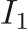. The image coordinate as 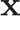 (typically a 2d or 3d vector). To simplify notation, we will not bold  in the rest of the article.

In fluid-based image registration method, each location typically discreted by image coordinate x has its own velocity at time point t, v(x,t), it can either be temporally variant  or -invariant 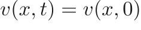 during the registration. For the image at time point t (here we assume 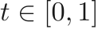), we denote it as 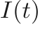. 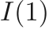 refers to the resulting warped image (compared with , the target image).

Back to the “similarity” and “smoothness”. On one hand, we are try to get an  that close to . The term "close" depends on the similarity metric. One the other hand, we would like to regularize the flow to be an continuous, both spatially and temporally, flow. So we can define the problem like this 

The 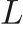 here refers the regularizer that encourages the property of the velocity field. So the first term is the regularization term while the second term is the similarity term. The objective is to find the optimal velocity filed 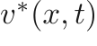.

So far so good? Now, let's introduce the famous advection equation. We simply the notation by denoting  and 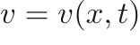. Besides, 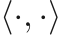 refers to dot product and 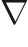 refers to spatial gradient.

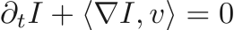

It may tell you nothing at the first glance (at least, I felt like that). To those who interests where it froms, here is the link (\url{https://www.youtube.com/watch?v=atvw5iseoGQ}).
A short summary is according to this equation, once we have  and v(x,t), we can moving the image  according to  ( the v here is extactly the same as what you understand in physical way) and get the next time step image by computing 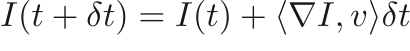.

Finally, For the typical fluid-based registration, we get the formulation like this

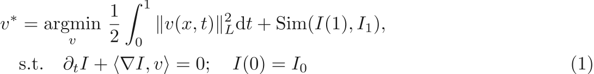

\section{Why fluid-based models}
So what's the advantage of the fluid-based registration methods compared with other registration methods, i.e. elastic registration methods. Let's denote the transformation map as 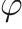 and the warped image can be represented by 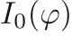 or 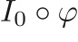. For the source image, we can define identity map 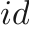, that 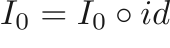. One key difference is that the fluid-based method penalized on velocity field, 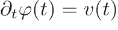, while the elastic registration methods directly penalize on the displacement map 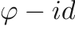. A tiny velocity field can accumlated to large displacement after a large time t, which means the regularization on velocity can be much smaller than penalization on the displacement map. Besides, the velocity field is continous in time, as long as the velocity field is smooth and no-folding the accumulated displacement field is also smooth and inversible, which is much easier to be realized compared with model that penalizes on the displacement map. Let's see an example from[], which illustrate how powerful fluid-based models compared with elastic models (the image refers to ).

\section{Typical models}

Now, let's start explore a family of fluid-based registration.
Here is the full menu.

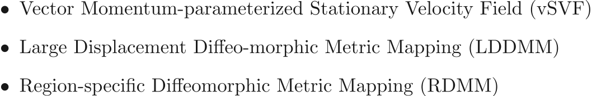

One more time, let's recall  determines the how image 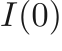 flows into  and the regularizer  determines how  is regularized.

The regularizer  is can be anything, like LASSO, Least Square ...
Here we may skip some awsome math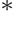 (\href{http://campar.in.tum.de/twiki/pub/DefRegTutorial/WebHome/MICCAI_2010_Tutorial_Def_Reg_Darko.pdf}{link}). We introduce momentum m, and velocity field can be smoothed from 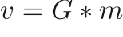, where 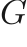 is gaussian smoother.

{\it 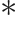(Optional) The key idea is to get a velocity field v, which can be define in Sobolev spaces, where 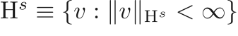 with 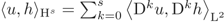, meaning sum of any order derivatives on 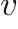 are bounded.  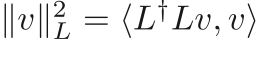, we introduce  or 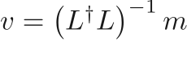. According Green's function, assume  is in Sobolev spaces and 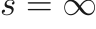, it is equivalent to get 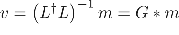}

The advantage of introducing momentum 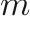 is that we can optimize over momentum , even if the optimal m is not smooth, we can get an smooth  by applying gaussian smoother. In practice, the multi-gaussian smoother allows multi-scale regularier and can get better registration results.

mtov.png

Before, we get into each method, let's first see how these methods related.

tree.png

\subsection{Vector Momentum-parameterized Stationary Velocity Field (vSVF)}

The relative simple model is Momentum-parameterized Stationary Velocity Field (vSVF), where it assume the velocity field  is temporal invariant, which refers the momentum  is also temporal invariant. Besides the regularizer(or you can just view it as a gaussian smoother) is fixed or spatio-temporal invariant.

See how vSVF performs:

The following part is optional:

We have , and 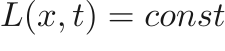, so 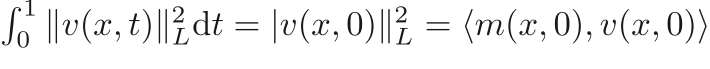 the Eq. \ref{eq:general} turns into

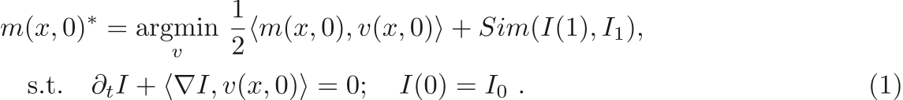

The objective is to search optimal 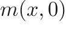, which determines how the image flows.

\subsection{Large Displacement Diffeo-morphic Metric Mapping (LDDMM)}

Maybe you have noticed the limits of the vSVF, since the v(x,t) is fixed along time axes, which can be a large constrain. So let's remove it, and then comes famous Large Displacement Diffeo-morphic Metric Mapping (LDDMM). In LDDMM, the v(x,t)= v(x,t)! However, the regularizier (or you can just view it as a gaussian smoother), like vSVF, is fixed.

See how LDDMM performs:

The following part is optional:

We have , and , but it can be proven, in optimal condition (beyond this introduction), the energy is conserved, . The Eq. \ref{eq:general} turns into

The objective is to search optimal , which determines how mometum 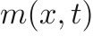 evolves, since the velocity is smoothed from , it indirectly determines how the image flows.

\subsection{Region-specific Diffeomorphic Metric Mapping (RDMM)}

At this point, you may already predict the improvement in RDMM (if you ignore the family tree above.):)
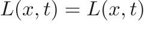! Every parameter own its freedom.
And yes, RDMM is a generalization on the LDDMM. 
In RDMM, we give the  full freedom. But we add a reasonable assumption, the  flows with the image,,  So what's the influence? Region-specific regularizer, which means each region (pixel level) has its own regularizer during the registration. The regularizer tracks how image moves. If at 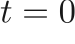, the regularizer of a region is large, then this region will not experience crazy deformation, vice versa.
So let's see how RDMM with a pre-defined regularizer peforms.

But since RDMM is a generalization of LDDMM, can it perform regular task? Of course, see the following task with an optimized regularizer.

The following part is optional:

First, how the regularizer  tracks the image ?
The advevtion equation. The same idea on advect the image. 

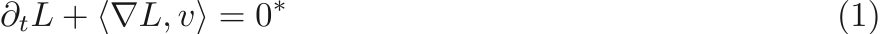

{\it  The regularizer  is a multi-gaussian smoother, so in practice, the parameters of the smoother is advected. To ensure the spatial smoothness of the mutli-gaussian smoother(since each location has its own smoother with different parameters), a pre-parameter (similar idea like introducing momentum) is introduced. All these are beyond this introduction, for those who are interests, please refer to to\href{https://arxiv.org/pdf/1906.00139.pdf}{RDMM}}

It can be proven, in optimal condition (beyond this introduction) of a specific formulation between  and  can conserve energy of term 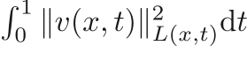, . The Eq. \ref{eq:general} turns into

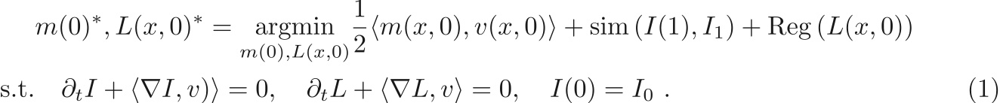

The objective is to search optimal  and 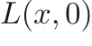, which determines how mometum  and the regularizer  evolve, since the velocity is smoothed from  by , it indirectly determines how the image flows.

